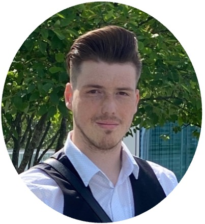
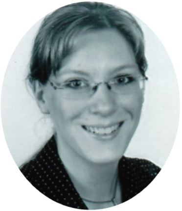

```{r setup, include=FALSE}
knitr::opts_chunk$set(echo = TRUE)
```


{width=25%}

## Mason A. Wirtz

Mason Wirtz is a PhD candidate at the Department of German Language and Literatures. 

E-Mail: mason.wirtz@plus.ac.at

<br>
<br>
<br>


{width=25%}

## Eugen Unterberger

Eugen Unterberger is a PhD candidate at the Department of German Language and Literatures.

E-Mail: eugen.unterberger@plus.ac.at


<br>
<br>
<br>


{width=25%}

## Birgit Füreder

Birgit Füreder is a PhD candidate at the Department of Romance Languages. 

E-Mail: birgitursula.fuereder2@plus.ac.at


<br>
<br>
<br>
