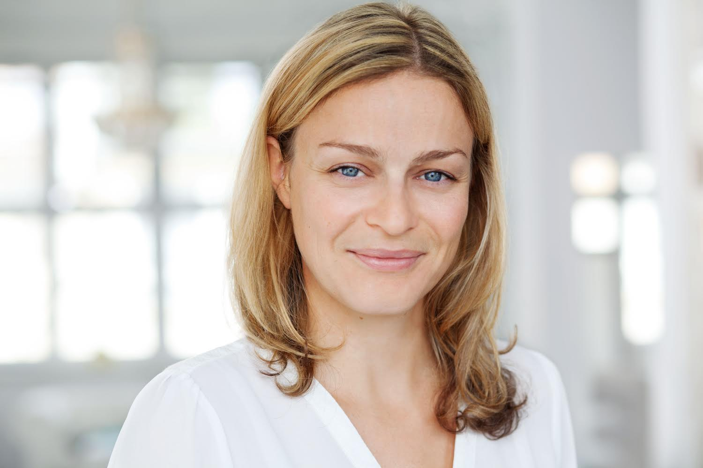
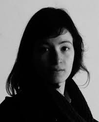
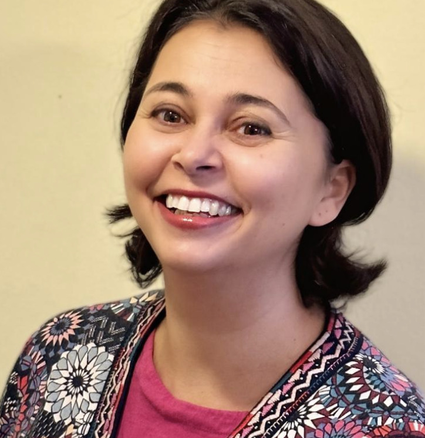
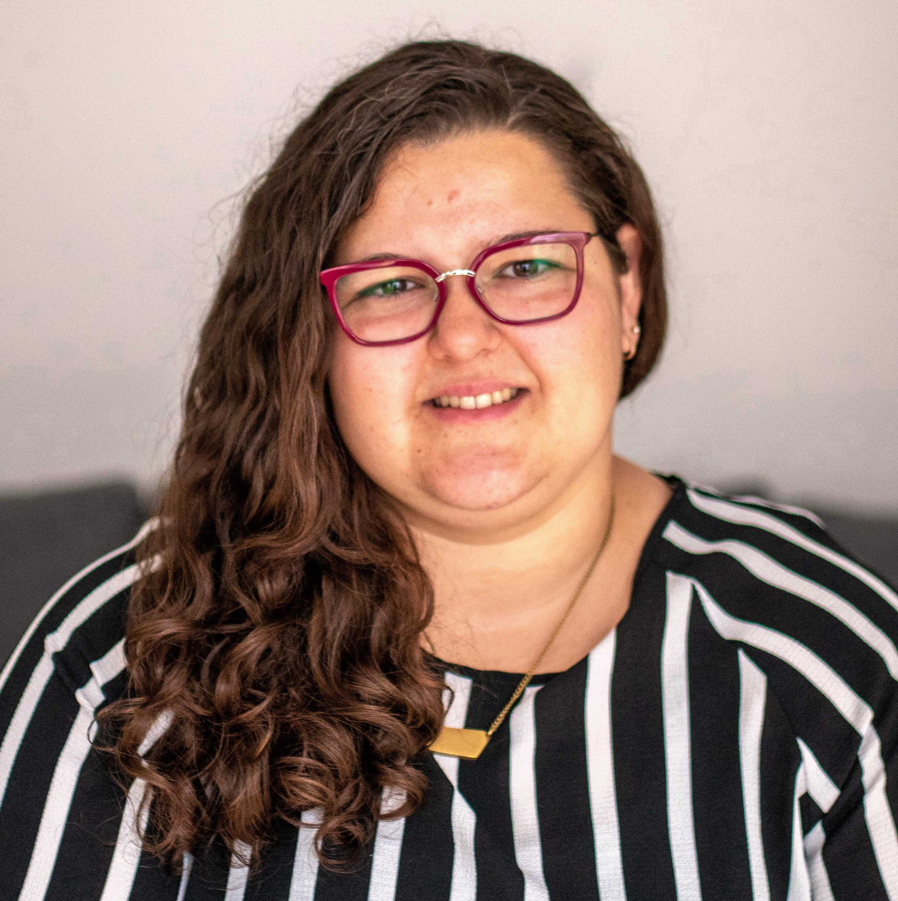
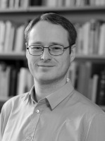
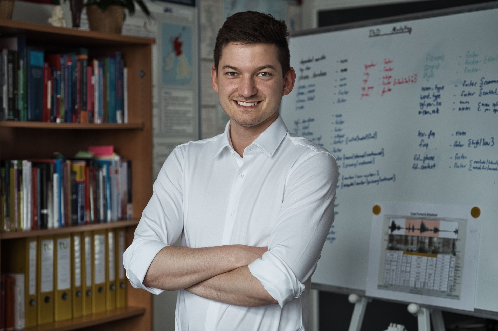

```{r setup, include=FALSE}
knitr::opts_chunk$set(echo = FALSE)
```


## Dr. Kate Stone

Lecture Date: 04. MAY, 2023

{width=40%}

Dr. Kate Stone is a psycholinguist in the Cognitive Neuroscience Lab at the University of Potsdam, Germany. Her research interests are in probabilistic sentence processing and how uncertainty and conflict affect readers' linguistic expectations. She uses EEG and computational modelling to examine how these expectations unfold over time.

<details>
  <summary>Title and Abstract</summary>
  
<br>
  
  
**Analysing the timecourse of experimental effects in eyetracking data**

*Tracking language users' eyes as they read or listen provides us with valuable insights into language cognition. By analysing how the eyes move as new input is received, we can make inferences about changes in cognitive processing. A common question in language cognition research is about the timing of these changes: for example, are non-native listeners slower to comprehend particular types of sentences than native speakers? If so, why? In this talk I will discuss how reading eye tracking and the visual world paradigm can be used for analysing the timecourse of language processing. I will introduce our own method for quantifying and comparing the onsets of experimental effects in visual world data, and show how the method allowed us to answer a question about why non-native speakers might be slower to process particular types of syntactic cues. Overall, the talk should give a broad overview of the issue of timecourse analysis in eye tracking, as well as introduce a specific timecourse analysis method with links to example code and data.*

</details> 


<br>
<br>
<br>


## Dr. Yves Scherrer

Lecture Date: 25. MAY, 2023


Dr. Yves Scherrer a university lecturer in Language Technology at the University of Helsinki, where he arrived in March 2017 as a post-doctoral researcher. Prior to that, he spent several years at the University of Geneva.

<details>
  <summary>Title and Abstract</summary>
  
<br>
  
  
**Neural machine translation for low-resource and variation-rich languages**

*Current machine translation architectures are based on deep neural networks and provide impressive translation quality for the major language pairs. I will start by giving a high-level overview of neural machine translation architectures and then focus on two challenging application scenarios.*
 
*The first scenario concerns low-resource languages. I will present our participation in the AmericasNLP shared task, which focuses on machine translation from Spanish to eleven indigenous languages of the Americas. I describe how a combination of techniques, ranging from data collection to knowledge distillation and post-processing, helps improve the translation quality.*
 
*In the second scenario, I investigate the suitability of neural machine translation techniques for the automatic normalization of phonetic transcriptions in multi-dialectal corpora. In this case, our focus does not lie in optimal normalization performance, but rather what the model learns about the different dialects and their relation with each other during the training process. In our case study with large Finnish and Norwegian dialect corpora, the model successfully identified the major dialect areas known from prior dialectological research.*

</details> 


<br>
<br>
<br>


## Dr. Laura Rosseel

Lecture Date: 29. JUNE, 2023

{width=30%}

Dr. Laura Rosseel's research interests mainly lie in the fields of sociolinguistics, language variation and change, and experimental linguistics. Her PhD research focused on innovating the measurement of the social meaning of language variation. More specifically, she studied on a number of implicit attitude measures recently developed in social psychology and investigated whether it is possible to adapt these new attitude measures and use them to study language attitudes. Laura’s dissertation comprised three studies in which the Personalized Implicit Association Test (P-IAT) and the Relational Responding Task (RRT) are used to measure attitudes towards five varieties of Dutch: Standard Belgian Dutch and four regional varieties of Colloquial Belgian Dutch.

<details>
  <summary>Title and Abstract</summary>
  
<br>
  
  
**New approaches to measuring the social meaning of language variation. The potential of the IAT and RRT for sociolinguistics**

</details> 


<br>
<br>
<br>


## Dr. Pia Pichler

Lecture Date: 09. NOVEMBER, 2023

{width=30%}

Dr Pia Pichler is Senior Lecturer in Linguistics and Programme Convenor of the MA Sociocultural Linguistics in the Department of English and Comparative Literature, at Goldsmiths, University of London. Dr. Pichler's research focuses on the discursive construction of intersectional identities in the spontaneous talk of young people, in particular on intersections of language and gender with social class, ethnicity and race, but also on indexicality, humour, double-voicing and authenticity.

<details>
  <summary>Title and Abstract</summary>
  
<br>
  
  
**Analysing masculinities in spoken interaction: intersectionality, indexicality and “voice”**

</details> 


<br>
<br>
<br>


## Dr. Henriette Arndt

Lecture Date: 16. NOVEMBER, 2023

{width=30%}

Dr. Henriette Arndt is a researcher with 6+ years of experience in combining quantiative and qualitative approaches for problem solving and knowledge creation. Her background is in psychology and applied linguistics, and she is particularly interested in how digital technology and popular culture shape how we use and learn second languages. She currently works as Postdoctoral Research Fellow on the LANG-TRACK-APP at Lund University Humanities Lab. Their cross-functional team is developing a smartphone app to help researchers to better study when, where, and how people use different languages beyond the classroom.


<details>
  <summary>Title and Abstract</summary>
  
<br>
  
  
**Experience Sampling Methods**

</details> 


<br>
<br>
<br>


## Dr. Philip Vergeiner

Lecture Date: 30. NOVEMBER, 2023

{width=30%}

Dr. Philip C. Vergeiner ist derzeit akademischer Rat an der LMU München. Davor hatte er eine Postdoc-Position im Rahmen des Spezialforschungsbereichs „Deutsch in Österreich“ an der Paris Lodron-Universität Salzburg inne und war zudem als Projektmitarbeiter an der Universität Innsbruck tätig, wo er 2019 promoviert wurde.


<details>
  <summary>Title and Abstract</summary>
  
<br>
  
  
**Dialektometrie**

</details> 


<br>
<br>
<br>


## JProf. Dr. Andreas Weilinghoff 

Lecture Date: 14. DECEMBER, 2023 / 15. DECEMBER, 2023

{width=30%}

JProf. Dr. Andrea Weilinghoff is a junior professor in English linguistics at the University of Koblenz, the youngest university in Germany. He has a passion for speech and speech technology as well as for data processing and analysis.

His research background is rooted in phonetics and sociolinguistics, but there are very smooth transitions into computer linguistics and corpus linguistics.
One of his major goals is to make the newest technology accessible and usable for teaching and research. While there are many shiny toys and exciting AI tools out there, it is still relatively difficult to implement them effectively for different projects. This is what JProf. Dr. Weilinghoff wants to change.


<details>
  <summary>Title and Abstract</summary>
  
<br>
  
  
**Introduction to Whisper**

</details> 


<br>
<br>
<br>